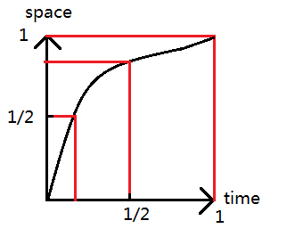

# SVG.js 中文说明

[toc]

## 说明

网上好像没有相关的中文文档，这样的话我就自己写一个了，按照官方那边的来写

[SVG.js官网GitHub](https://github.com/wout/svg.js "svg.js");

支持IE9+

另外这个翻译仅仅只是个人学习交流之用啊，千万别作其他用途，另外很多都是自己的理解，看不懂的话可以去看下源文。小白一个就不要吐槽那么多了

## 用法

### Create an SVG document 创建一个SVG的节点

使用`SVG()`方法来创建一个svg的节点到给定的一个html节点之中

```javascript
var draw = SVG('drawing').size(300, 300)
var rect = draw.rect(100, 100).attr({ fill: '#f06' })
```

第1个参数既可以是一个给定id的节点，也可以是一个已经被获取了的节点，这样会被生成如下的结构

```html
<div id="drawing">
  <svg xmlns="http://www.w3.org/2000/svg" version="1.1" xmlns:xlink="http://www.w3.org/1999/xlink" width="300" height="300">
    <rect width="100" height="100" fill="#f06"></rect>
  </svg>
</div>
```

自己注： 其中，id为`drawing`的div是原本就存在的了，这样的话会把svg插入到这个节点之内

在默认的情况下，svg的大小取决于你第1个参数的尺寸大小，就相当于

```javascript
var draw = SVG('drawing').size('100%', '100%')
```

### Checking for SVG support 检查是否支持svg

在使用SVG.js的时候，它是默认你支持svg的，但是你可以使用它提供的方法去检测是否支持svg

```javascript
if (SVG.supported) {
  var draw = SVG('drawing')
  var rect = draw.rect(100, 100)
} else {
  alert('SVG not supported')
}
```

### SVG document SVG节点

SVG.js在html节点之外，在svg节点里面也能够可以正常的运行，例如

```html
<?xml version="1.0" encoding="utf-8" ?>
<svg id="drawing" xmlns="http://www.w3.org/2000/svg" xmlns:xlink="http://www.w3.org/1999/xlink" version="1.1" >
  <script type="text/javascript" xlink:href="svg.min.js"></script>
  <script type="text/javascript">
    <![CDATA[
      var draw = SVG('drawing')
      draw.rect(100,100).animate().fill('#f03').move(100,100)
    ]]>
  </script>
</svg>
```

### Sub-pixel offset fix 子元素的偏移

使用方法`spof()`来获取子元素的偏移

```javascript
var draw = SVG('drawing').spof()
```

当改变窗口大小要使之自适应偏移的时候，可以使用下面的方法

```javascript
SVG.on(window, 'resize', function() { draw.spof() })
```

自己注: 暂时不上很懂这个是什么意思,自己试了一下，如果给svg加定位的话用了这个方法，他会自动的修改使之回到`left:0,top:0`

## 父节点

### Main svg document SVG根节点

SVG.js主要的初始化方法是在一个给定的节点中创建一个svg的根节点标签，并且返回一个`SVG.Doc`实例

```javascript
var draw = SVG('drawing')
```

`return`: `SVG.Doc`

继承关系 `SVG.Doc` < `SVG.Container` < `SVG.Parent`

### Nested SVG 嵌套svg

利用这个方法，你可以嵌套在任意一个节点之中。这个嵌套的的svg所拥有的特性方法跟顶层svg节点是一样的。

`return`: `SVG.Nested`

继承关系 `SVG.Nested` < `SVG.Container` < `SVG.Parent`

### Groups 分组

如果你想transform一组元素，那么对元素分组是非常有用的。所有的节点都在一个分组里面，这样能很好的保证他们所属的相对位置，一个`group`能像svg根节点那样，拥有所有的调用节点方法

```javascript
var group = draw.group()
group.path('M10,20L30,40')
```

如果一个节点已经存在的话，也可以把它增加进去一个`group`里面 `group.add(rect)`

注意： `groups`是没有大小的，它依赖于它的内容。因此它是没有`x`,`y`,`width`跟`height`,如果你需要这些的话，使用`nested()`,嵌套svg去代替`group`

`return`: `SVG.G`

继承关系 `SVG.G` < `SVG.Container` < `SVG.Parent`

### Hyperlink 超链接

一个超链接或者`<a>`标签创建的内容可以使得它的所有子级都是指向一个链接

```javascript
var link = draw.link('http://svgjs.com')
var rect = link.rect(100, 100)
```

链接可以用`to()`去更新

```javascript
link.to('http://apple.com')
```

此外，这个link的节点还有一个`show()`的方法去设置`xlink:show`的属性

```javascript
link.show('replace')
```

然后还有一个`target()`的方法去改变`target`的属性

```javascript
link.target('_blank')
```

节点还可以用`linkTo()`，让自己链接到其他地方去

```javascript
rect.linkTo('http://svgjs.com')
```

或者可以通过一个块去代替一个url来获取这个链接节点的更多参数

```javascript
rect.linkTo(function(link) {
  link.to('http://svgjs.com').target('_blank')
})
```

`return`: `SVG.A`

继承关系 `SVG.A` < `SVG.Container` < `SVG.Parent`

### Defs 引用

`<defs>`节点是一个放置引用元素的容器。它的所有后代元素都不会被渲染。`<defs>`会一直存在于svg节点中，并且可以利用`defs()`来进行存取。

```
var defs = draw.defs()
```

defs还可以通过另一个元素的`doc()`方法获取到

```javascript
var defs = rect.doc().defs()
```

`return`: `SVG.A`

继承关系 `SVG.A` < `SVG.Container` < `SVG.Parent`

## Rect 矩形

Rect 有2个参数，他们分别是`width`和`height`

```javascript
var rect = draw.rect(100, 100)
```

`return`: `SVG.Rect`

继承关系 `SVG.Rect` < `SVG.Shape` < `SVG.Element`

### radius()

矩形还可以设置他们的弧度

```javascript
rect.radius(10)
```

这样的会设置他们的`rx`和`ry`都是10，如果要分别设置的话，可以向下面这样

```javascript
rect.radius(10, 20)
```

`returns`: `itself`

## Circle 圆

它只有一个参数，这个参数是它的直径

```javascript
var circle = draw.circle(100)
```

`return`: `SVG.Circle`

继承关系 `SVG.Circle` < `SVG.Shape` < `SVG.Element`

### radius()

重新定义它的半径

```javascript
circle.radius(75)
```

`returns`: `itself`

## Ellipse 椭圆

跟矩形一样，有两个参数`width`,`height`

```javascript
var ellipse = draw.ellipse(200, 100)
```

`return`: `SVG.Ellipse`

继承关系 `SVG.Ellipse` < `SVG.Shape` < `SVG.Element`

### radius()

允许重新设置两个半径

```javascript
ellipse.radius(75, 50)
```

`returns`: `itself`

## Line 直线

创建一条从点a到点b的直线

```javascript
var line = draw.line(0, 0, 100, 150).stroke({ width: 1 })
```

生成了的直线改变它有4种方式，可以看下`plot()`方法查阅所有的用法

### plot()

更新一个直线可以用`plot()`来更新

```javascript
line.plot(50, 30, 100, 150)
```

或者它也接受传入的参数是一个坐标字符串

```javascript
line.plot('0,0 100,150')
```

或者参数是一个数组

```javascript
line.plot([[0, 0], [100, 150]])
```

也可以用`SVG.PointArray`代替

```javascript
var array = new SVG.PointArray([[0, 0], [100, 150]])
line.plot(array)
```

`returns`: `itself`

### array() 坐标点

参考于 `SVG.PointArray`的实例，这个方法只能限于内部使用<br>
方法的作用返回是一个数组，数组的每一个值都是包含x,y的点

```javascript
polyline.array()
```

`returns`: `SVG.PointArray`

## Polyline 折线

折线它定义一组连接在一起的直线,它的形状不是闭合在一起的，也就是起点跟终点不是不会直接连接

```javascript
var polyline = draw.polyline('0,0 100,50 50,100').fill('none').stroke({ width: 1 })
```

折线他是由一组用空格分割的点组成的，就像这样`x,y x,y x,y` 如果你用一组数组的话，也是同样可以绘制出的，就像下面这样

```javascript
// polyline([[x,y], [x,y], [x,y]])
var polyline = draw.polyline([[0,0], [100,50], [50,100]]).fill('none').stroke({ width: 1 })
```

`returns`: `SVG.Polyline`

继承关系 `SVG.Polyline` < `SVG.Shape` < `SVG.Element`

### plot()

polyline也可以用`plot()`这个方法来更新点

```javascript
polyline.plot([[0,0], [100,50], [50,100], [150,50], [200,50]])
```

`plot()`这个方法还可以结合`animate`做成动画

```javascript
polyline.animate(3000).plot([[0,0], [100,50], [50,100], [150,50], [200,50], [250,100], [300,50], [350,50]])
```

`returns`: `itself`

### array()

因为`polyline`是`SVG.PointArray`的实例，当然也可以使用它的内部方法

`returns`: `SVG.Polyline`

## Polygon 多边形

polygon(多边形)它不像polyline(折线)那样，它是由一组前后连接的线段组成的一个封闭图形，就像这样 :

```javascript
// polygon('x,y x,y x,y')
var polygon = draw.polygon('0,0 100,50 50,100').fill('none').stroke({ width: 1 })
```

polygon对于参数的要求跟polyline是一样的，这里没有必要让最后一个点跟第1个点一样来达到闭合的目的，它的闭合是自动的，自动将第1个点跟最后一个点连接起来

`returns`: `SVG.Polygon`

继承关系 `SVG.Polygon` < `SVG.Shape` < `SVG.Element`

### plot()

polygon也可以用`plot()`这个方法来更新点

```javascript
polygon.plot([[0,0], [100,50], [50,100], [150,50], [200,50]])
```

`plot()`这个方法还可以结合`animate`做成动画

```javascript
polygon.animate(3000).plot([[0,0], [100,50], [50,100], [150,50], [200,50], [250,100], [300,50], [350,50]])
```

`returns`: `itself`

### array()

因为`polygon`是`SVG.PointArray`的实例，当然也可以使用它的内部方法

`returns`: `SVG.PointArray`

## Path 路径

路径描绘出来的线跟多边形是很像的，但是它为了能支持曲线会显得比较的复杂

```javascript
draw.path('M 100 200 C 200 100 300  0 400 100 C 500 200 600 300 700 200 C 800 100 900 100 900 100')
```

`returns`: `SVG.Path`

继承关系 `SVG.Path` < `SVG.Shape` < `SVG.Element`

关于`path`更详细的信息，可以参考SVG Documentation ： ['http://www.w3.org/TR/SVG/paths.html#PathData']('http://www.w3.org/TR/SVG/paths.html#PathData',pathdata)

### plot()

path也可以用`plot()`这个方法来更新点

```javascript
path.plot('M100,200L300,400')
```

`returns`: `itself`

### array()

因为`path`是`SVG.PointArray`的实例，当然也可以使用它的内部方法

`returns`: `SVG.PointArray`

## Image 图片

创建图像是你所期待的

```javascript
var image = draw.image('/path/to/image.jpg')
```

如果你知道图片的尺寸的话，可以通过第2，3个参数传递进去

```javascript
var image = draw.image('/path/to/image.jpg', 200, 300)
```

`returns`: `SVG.Image`

继承关系 `SVG.Image` < `SVG.Shape` < `SVG.Element`

### load()

你可以用`load()`方法来加载另外一张图片

```javascript
image.load('/path/to/another/image.jpg')
```

### loaded()

如果你不知道图片的尺寸，很显然你需要等图片加载完

```javascript
var image = draw.image('/path/to/image.jpg').loaded(function(loader) {
  this.size(loader.width, loader.height)
})
```

返回值loader对象里面包含4个值：

1. `width`
2. `height`
3. `ratio` (width/height)
4. `url`

`return` : `itself`

## Text 文本

与HTML的文本不同，文本在SVG是比较难控制的。没有办法去创建随心所欲的文本，所以如果文本要另起一行的话，就需要手动的加入换行符。在SVG有2种办法创建SVG文本

首先，也是最简单的办法是提供一个文本字符串，可以加入你所需要的换行符去换行

```javascript
var text = draw.text("Lorem ipsum dolor sit amet consectetur.\nCras sodales imperdiet auctor.")
```

这样会创建出一个文本块，并且在需要的地方换行

第2个方法会让你更加自由的控制文本，但是这样也需要更多的代码：

```javascript
var text = draw.text(function(add) {
  add.tspan('Lorem ipsum dolor sit amet ').newLine()
  add.tspan('consectetur').fill('#f06')
  add.tspan('.').newLine()
  add.tspan('Cras sodales imperdiet auctor.').newLine().dx(20)
  add.tspan('Nunc ultrices lectus at erat').newLine()
  add.tspan('dictum pharetra elementum ante').newLine()
})
```

如果你想要另外一种方法，并且不想总是创建`tspan`，并且只仅仅只有一行，那样你可以使用`plain()`这个办法去代替:<br>
(自己注：这样的话就是直接创建的是一个`text`标签而不是`tspan`标签)

```javascript
var text = draw.plain('Lorem ipsum dolor sit amet consectetur.')
```

当你不需要换行的时候，`SVG.Text`的`plain`方法是一个比较方便快捷的方法

继承关系 `SVG.Text` < `SVG.Shape` < `SVG.Element`

### text()

改变文本的内容可以通过`text()`方法来实现

```javascript
text.text()
```

`returns`: `itself`

获取全部的文本也可以使用`text()`方法

```javascript
text.text()
```

`returns`: `string`

### tspan()

增加一个tspan

```javascript
text.tspan(' on a train...').fill('#f06')
```

### plain()

如果该元素不需要多栏或者换行，那样这个方法就足够可以去增加一些需要的文本了。

```javascript
text.plain('I do not have any expectations.')
```

`returns`: `itself`

### font()

`sugar.js`模块提供了一些特别的语法给这些节点

```javascript
text.font({
  family:   'Helvetica'
, size:     144
, anchor:   'middle'
, leading:  '1.5em'
})
```

`returns`: `itself`

### leading() 间距

对于HTML来说，间距是通过`line-height`去定义的，在SVG中并有像HTML那样有样式可以去定义行高。在SVG中，基线是没有被定义出来的。他们都是通过`tspan`的一个`dy`属性去定义这个行高，一个`x`值去重新设置基线在父元素`text`的水平位置。但是你也可以有很多节点在一条基线上，但是拥有不同的`y` 、`dy` 、 `x` 甚至是 `dx`值。这给了我们更多的自由，但是也给了我们更多的麻烦。我们应该决定一个基线应该什么时候去定义，它的起始点是哪里，偏移量是多少，高度是多少。当你设置一些样式行为时，SVG的`leading()`方法尽可能的接近HTML。文本的多行组合，它看了来就跟HTMl跟接近了。

```javascript
var text = draw.text("Lorem ipsum dolor sit amet consectetur.\nCras sodales imperdiet auctor.")
text.leading(1.3)
```

这样会为`text`会在渲染每一行`tspan`的时候，为它们的dy属性设置`130%`的`font-size`大小

需要注意的是，leading()方法假设一个文本节点中的每一级`tspan`都代表新的一行。如果是使用在一个包含很多`tspan`的文本节点中（没有通过包裹`tspan`来定义新的一行），会被渲染成不正常的，所以最好小心的使用这个方法，最好是用在用换行符分割的文本或者是调用`newline()`方法，通过传递参数，去设置每一级的`tspan`，使之成为块级。

PS ：就是用的时候最好保证他是一行一行的，而不是连续的span，这样的话会有问题，我是这么理解的

`return` : `itself`

### build()

`build()`方法可以被用于设置启用或者禁用绘制模式。当绘制式被禁用的时候，`plain()`方法跟`tspan()`方法都会在增加新文本之前先调用`clear()`方法。当绘制模式被启用的时候，`plain()`跟`tspan()`方法会先增加新的文本内容到已有的内容之中。当遇到一个`text()`方法创建的文本块时，绘制模式会自动在这个文本块之前或者之后调用，但是在某些情况下，它可以让自由的手动切换。

ps: 类似于锁住当前文本内容，在内容中插入新的内容，否则每次调用都会先把之前的都清除掉。

```javascript
var text = draw.text('This is just the start, ')

text.build(true)  // enables build mode

var tspan = text.tspan('something pink in the middle ').fill('#00ff97')
text.plain('and again boring at the end.')

text.build(false) // disables build mode

//text.plain('4444')  如果之前build不是true的话这里执行了会清除之前的所有文本

tspan.animate('2s').fill('#f06')
```

### rebuild()

这是一个内部的回调，可能永远都不需要手动去调用这个方法。基本上当这个文本节点`font-size`,`x`属性或者调用`leading()` 去更新这个节点时，就会发生重绘。这个方法也可以设置或者禁用掉绘制

```javascript
text.rebuild(false) //-> disables rebuilding
text.rebuild(true)  //-> enables rebuilding and instantaneously rebuilds the text element  使之可以发生重绘并且马上重绘当前的文本节点
```

`return` : `itself`

### clear()

清除当前文本里的所有内容 PS：类似于html元素的`innerHTML = ''`；

```javascript
text.clear()
```

`return` : `itself`

### length()

获得计算之后文本的长度

PS：这里获取出来的是文字所占的内容宽度，而不是文字的长度，两者是有区别的， 其内部使用的是`getComputedTextLength`来获取的。

`return` : `number`

### lines()

获取文本标签的一级`tspan`节点。返回的是一个包含`members`的对象，对象里面是一个包含各个`tspan`的数组 PS： 如果是用`plain()`创建的话，则返回的是空数组

`return` : `SVG.Set`

### events

文本标签只有一个事件，它会在每次`rebuild()`的时候触发这个回调

```javascript
text.on('rebuild', function() {
  // whatever you need to do after rebuilding
  //
})
```

## Tspan

`tspan`标签只有在`text`标签或者在其他`tspan`标签才会有效，在SVG.js里面，他们有自己专属的类。

继承关系 `SVG.Tspan` < `SVG.Shape` < `SVG.Element`

### text()

可以通过一个字符串的参数来更新`tspan`的内容。

```javascript
tspan.text('Just a string.')
```

它这里调用的是plain的方法去实现的 或者也可以通过一个回调函数，增加更多的内容

```javascript
tspan.text(function(add) {
  add.plain('Just plain text.')
  add.tspan('Fancy text wrapped in a tspan.').fill('#f06')
  add.tspan(function(addMore) {
    addMore.tspan('And you can doo deeper and deeper...')
  })
})
```

`return` : `itself`

### tspan()

在`tspan`的内部嵌入一个`tspan`

```javascript
tspan.tspan('I am a child of my parent').fill('#f06')
```

`return` : `SVG.Tspan`

### plain()

增加简单的文本

```javascript
tspan.plain('I do not have any expectations.')
```

`return` : `itself`

### dx()

动态去设置元素的`x`值，跟一个html元素设置了`position:relative`跟`left`是相似的

```javascript
tspan.dx(30)
```

`return` : `itself`

### dy()

动态去设置元素的`y`值，跟一个html元素设置了`position:relative`跟`top`是相似的

```javascript
tspan.dy(30)
```

`return` : `itself`

### newLine()

`newLine`方法可以非常方便的利用当前的`leadding（行高）`，去设置`dy`属性，从而创建新的一行

```javascript
var text = draw.text(function(add) {
  add.tspan('Lorem ipsum dolor sit amet ').newLine()
  add.tspan('consectetur').fill('#f06')
  add.tspan('.')
  add.tspan('Cras sodales imperdiet auctor.').newLine().dx(20)
  add.tspan('Nunc ultrices lectus at erat').newLine()
  add.tspan('dictum pharetra elementum ante').newLine()
})
```

`return` : `itself`

### clear()

清除`tspan`内的所有内容 PS：类似于html元素的`innerHTML = ''`；

```javascript
tspan.clear()
```

`return` : `itself`

### length()

获得`tspan`的所占的宽度

```javascript
tspan.length()
```

`return` : `number`

## TexrPath

文本可以沿着路径去运动在SVG中是一个很棒的特性。

```javascript
var text = draw.text(function(add) {
    add.tspan('We go ')
    add.tspan('up').fill('#f09').dy(-40)
    add.tspan(', then we go down, then up again').dy(40)
})
text
    .path('M 100 200 C 200 100 300 0 400 100 C 500 200 600 300 700 200 C 800 100 900 100 900 100')
    .font({
        size: 42.5,
        family: 'Verdana'
    })
```

文本元素在调用`path()`方法的时候，就相当于在属性上介于文本跟路径元素之间，从这一点上，文本元素也可以调用`plot()`方法来更新路径。

```javascript
text.plot('M 300 500 C 200 100 300 0 400 100 C 500 200 600 300 700 200 C 800 100 900 100 900 100')
```

`<textPath>`特殊的属性可以被应用到`textPath`实例本身

```javascript
text.textPath().attr('startOffset', 100)
```

当然了，对这些特殊的属性做动画

```javascript
text.textPath().animate(3000).attr('startOffset', 0.8)
```

`return` : `SVG.TextPath`

继承关系 `SVG.TextPath` < `SVG.Element`

### textPath()

返回`textPath`的引用

```javascript
var textPath = text.textPath()
```

`return` : `SVG.TextPath`

### track()

返回textPath所链接的路径

```javascript
var path = text.track()
```

`return` : `SVG.Path`

## Use

`use`元素可以简单的引用另外一个已经存在的元素。这个已经存在的元素的任何改变都可以直接反应在use的实例上。`use`的用法非常的简单

```javascript
var rect = draw.rect(100, 100).fill('#f09')
var use  = draw.use(rect).move(200, 200)
```

在例子中的svg出现了2个矩形，一个是原来的，一个是被引用的。在很多情况下，我们想隐藏矩形源，最好的办法是在`defs`节点中创建这个矩形源。

```javascript
var rect = draw.defs().rect(100, 100).fill('#f09')
var use  = draw.use(rect).move(200, 200)
```

这种方式的话，矩形元素就好像一个储存库那样，你可以去更改它的属性，但是它是不会被渲染出来的。 另一种方法是指向一个外部的svg文件，只需要指明这个元素的id跟路径地址就可以了，就想这样：

```javascript
var use  = draw.use('elementId', 'path/to/file.svg')
```

这种方式是很有用的，特别是当你已经创建了一个复杂的图形。值得注意的是，外部图形（不同域）可能会需要用XHR的办法去加载。

`return` : `SVG.Use`

继承关系 `SVG.Use` < `SVG.Shape` < `SVG.Element`

## Symbol

跟`group`元素很像的是，`symbol`元素也是一个容器元素。两者之间的区别是`symbol`它不会被渲染出来。因此`symbol`元素对于用`use`组合来说是完美的。

```javascript
var symbol = draw.symbol()
symbol.rect(100, 100).fill('#f09')

var use  = draw.use(symbol).move(200, 200)
```

`return` : `SVG.Bare`

继承关系 `SVG.Bare` < `SVG.Element`[浅继承于SVG.Parent]

## Bare

对于SVG.js没有描述的所有SVG元素，`SVG.Bare`这个类就派上用场了。这个类直接从`SVG.Element`继承，并且可以在单独的命名空间里添加自定义方法，这样可以不污染主`SVG.Element`命名空间。给了你很大的发挥空间

PS： 其实就是用来创建svgjs没有说到的标签，例如是一个自定义的标签等等

### element()

`SVG.Bare`可以直接通过父元素`element()`方法实现实例化。

```javascript
var element = draw.element('title')
```

第一个参数传递的字符串值是创建出来的节点的名字 PS：例如你传个title，就会创建一个title的标签

此外，任何现有的类名都可以作为第二个参数来定义，表明这个新创建元素继承。

```javascript
var element = draw.element('symbol', SVG.Parent)
```

这给了使用者很大的能力，但是请记住，能力越大，责任越大

`return` : `SVG.Bare`

### words()

`SVG.Bare`实例有一个附带的方法去添加文本

```javascript
var element = draw.element('title').words('This is a title.')
//-> <title>This is a title.</title>
```

## Referencing elements 获取元素

### by id 通过id

如果你想一个通过id获取`SVG.js`创建出来的元素，那样你可以使用`SVG.get()`

```javascript
var element = SVG.get('my_element')

element.fill('#f06')
```

### Using Css Selectors 通过样式选择器

有两种通过样式选择器的方式 一种是检索这个SVG的全部，这将检索文档中所有的svg元素并且把它们`SVG.Set`的实例返回。 PS：一定要注意 这个检索的是所有的元素。无论你创建了多少个svg都一样

```javascript
var elements = SVG.select('rect.my-class').fill('#f06')
```

第二种方法是在父元素里面进行检索

```javascript
var elements = group.select('rect.my-class').fill('#f06')
```

### Using jQuery or Zepto 使用jQuery或者Zepto

另一种获取元素的方法是使用jQuery和Zepto，这里是一个例子

```javascript
// add elements
var draw   = SVG('drawing')
var group  = draw.group().addClass('my-group')
var rect   = group.rect(100,100).addClass('my-element')
var circle = group.circle(100).addClass('my-element').move(100, 100)

// get elements in group
var elements = $('#drawing g.my-group .my-element').each(function() {
  this.instance.animate().fill('#f09')
})
```

## Circular reference 重复引用

所有在`SVG.js`里被z实例化之后的元素都是真实存在的节点

### node 节点

```javascript
element.node
```

`returns`: `node`

### native()

同样可以用`native()`去实现

```javascript
element.native()
```

`returns`: `node`

### instance

相似的，返回的是节点在`SVG.js`的实例化引用 PS:跟前面的`element.node`、`element.native()`相反，一个是找节点，一个是找节点的实例化

```javascript
node.instance
```

`returns`: `element`

## 父级引用

每一个元素都有他们父级方法的引用

### parent()

PS:返回父级的引用，或者按照参数返回指定的父级

```javascript
element.parent();
```

`returns`: `element`

可以选择一个类名或者样式选择器来作为第1个参数传递进去

```javascript
var draw   = SVG('drawing')
var nested = draw.nested().addClass('test')
var group  = nested.group()
var rect   = group.rect(100, 100)

rect.parent()           //-> returns group
rect.parent(SVG.Doc)    //-> returns draw
rect.parent(SVG.Nested) //-> returns nested
rect.parent(SVG.G)      //-> returns group
rect.parent('.test')    //-> returns nested
```

`returns`: `element`

甚至可以是svg根节点

```javascript
var draw = SVG('drawing')

draw.parent() //-> returns the wrappig html element with id 'drawing'
//返回的是包裹着svg的id为drawing的节点
```

`returns`: `HTMLNode`

### doc()

检索跟节点svg你可以使用`doc()`

```javascript
var draw = SVG('drawing')
var rect = draw.rect(100, 100)

rect.doc() //-> returns draw
```

`returns`: `element`

### parents()

通过类型type或者样式选择器获取元素的所有父级(样式选择器可以看`parent()`方法)

```javascript
var group1 = draw.group().addClass('test')
  , group2 = group1.group()
  , rect   = group2.rect(100,100)

rect.parents()        // returns [group1, group2, draw]
rect.parents('.test') // returns [group1]
rect.parents(SVG.G)   // returns [group1, group2]
```

`returns`: `Array`

## Child reference 子级引用

### first()

获取元素节点的第1个子元素

```javascript
draw.first()
```

`returns`: `element`

### last()

获取元素节点的最后一个子元素

```javascript
draw.last()
```

`returns`: `element`

### children()

使用`children`方法可以检索所有的子节点(PS:只有一级，不会检索到子级的子级)，并且返回一个数组

```javascript
draw.children()
```

`return`: `array`

### each()

`each()`允许你遍历父元素的所有子元素

```javascript
draw.each(function(index, children) {
  this.fill({ color: '#f06' })
})
```

需要注意的是，`this`在这里指的是当前的child元素

`return`: `itself`

### has()

查看元素是否在于某个父级之中 PS:只能一级，例如:

```javascript
group > rect
group.has(rect) =>true
nested > group > rect
nested.has(rect) => false
```

```javascript
var rect  = draw.rect(100, 50)
var group = draw.group()

draw.has(rect)  //-> returns true
group.has(rect) //-> returns false
```

`return`: `boolean`

### index()

返回给定的元素在父元素的位置，从`0`开始。返回`-1`，则表示元素不在该父元素之中。

```javascript
var rect  = draw.rect(100, 50)
var group = draw.group()

draw.index(rect)  //-> returns 0
group.index(rect) //-> returns -1
```

`return`: `number`

### get(0)

在子级数组中获取指定位置的子级

```javascript
var rect   = draw.rect(20, 30)
var circle = draw.circle(50)

draw.get(0) //-> returns rect
draw.get(1) //-> returns circle
```

`return`: `element`

### clear()

移除父级中所有的元素

```javascript
draw.clear()
```

`return`: `itself`

## Import / export SVG 导入导出svg

可以通过`svg()`方法导出完整生成的SVG或一部分

```javascript
draw.svg()
```

导出所有的元素

导入使用相同的方法

```javascript
draw.svg('<g><rect width="100" height="50" fill="#f06"></rect></g>')
```

导入适用于用`SVG.Parent`继承的任何元素，基本上每个元素都可以包含其他元素

`getter` `returns`: `string` `settrt` `returns`: `itself`

## Attributes and styles 属性和样式

### attr()

通过`attr()`，你可以直接的获取或者设置元素的属性 获取单个属性

```javascript
rect.attr('x')
```

设置单个属性

```javascript
rect.attr('x', 50)
```

一次性设置多个属性

```javascript
rect.attr({
    `fill`: '#f06',
    'fill-opacity': 0.5,
    `stroke`: '#000',
    'stroke-width': 10
})
```

使用命名空间设置属性

```
rect.attr('x', 50, 'http://www.w3.org/2000/svg')
```

PS：上面的例子我自己试的时候会让`rect`出现2个`x`的，如果删除了命名空间的话就可以是正常的，可能是这个命名空间只是对于正常有命名空间的标签才有用。 EX：

```
var rect2 = draw.rect(100,100).move(200,200).fill('red');
rect2.attr('x', 50, 'http://www.w3.org/2000/svg');
```

移除属性

```javascript
rect.attr('fill',null);
```

`getter` `returns`: `value` `settrt` `returns`: `itself`

### style()

使用`style()`方法，可以像`attr()`管理`attr`那样管理`style`

```javascript
rect.style('cursor', 'pointer')
```

一次性批量设置样式可以用对象作为参数

```javascript
rect.style({ cursor: 'pointer', fill: '#f03' })
```

或者是用样式字符串

```javascript
rect.style('cursor:pointer;fill:#f03;')
```

就像`attr()`一样，`style()`的方法也可以作为`getter`获取样式

```javascript
rect.style('cursor')
// => pointer
```

甚至是全部的值

```javascript
rect.style()
// => 'cursor:pointer;fill:#f03;'
```

PS: 这里需要注意的是，如果是一些复合属性例如：`stroke-width` 这种带`-`的，不必按照JS获取样式那样写成驼峰，直接用回原来的即可。

删除单个样式的方法跟`attr()`是一致的。

```javascript
rect.style('fill',null)
```

`getter` `returns`: `value` `settrt` `returns`: `itself`

### fill()

`fill()`方法是`attr()`一个很好的替代方法。 PS：只是对于设置`fill`而言

```javascript
rect.fill({ color: '#f06', opacity: 0.6 })
```

一个十六进制的字符串参数也能够正常的被执行

```javascript
rect.fill('#f06')
```

最后，但是同样重要的是，你也可以使用图片作填充(fill)，只需要传递图片地址就可以了

```javascript
rect.fill('images/shade.jpg')
```

PS：SVG会在引用`defs`里面创建一个image，再用这个fill指向这个image

或者你想要更多的控制图片的大小，你也可以传递图片的实例

```javascript
rect.fill(draw.image('images/shade.jpg', 20, 20))
```

returns`:`itself`

### stroke()

`stroke()`方法跟`fill()`方法很像

```javascript
rect.stroke({ color: '#f06', opacity: 0.6, width: 5 })
```

跟`fill`一样，也能设置一个十六进制的字符串

```javascript
rect.stroke('#f06')
```

跟`fill()`方法没有什么不同，你也可以使用图片作为`stroke`，只需要传图片的地址作为参数即可

```javascript
rect.stroke('images/shade.jpg')
```

或者你想要更多的控制图片的大小，你也可以传递图片的实例

```javascript
rect.stroke(draw.image('images/shade.jpg', 20, 20))
```

`returns`: `itself`

### opacity()

设置元素的整体不透明度

rect.opacity(0.5)

`returns`: `itself`

### reference()

很多时候，元素都会通过属性链接另外一个元素。使用`reference`方法可以获取这个连接元素的实例，唯一的参数就是这个属性名称

```javascript
use.reference('href') //-> returns used element instance
// or
rect.reference('fill') //-> returns gradient or pattern instance for example
// or
circle.reference('clip-path') //-> returns clip instance
```

### hide()

隐藏元素 PS:`display:none`

```javascript
rect.hide()
```

`returns`: `itself`

### show()

显示元素

```javascript
rect.show()
```

`returns`: `itself`

### visible()

判断元素是否显示

```javascript
rect.visible()
```

`returns`: `boolean`

## Classes 类名

### classes()

返回包含这个节点所有类名的一个数组

```javascript
rect.classes()
```

`getter` `returns`: `array`

### hasClass()

判断是否有给定的类

```javascript
rect.hasClass('purple-rain')
```

`getter` `returns`: `boolean`

### addClass()

增加一个给定的类名

```javascript
rect.addClass('pink-flower')
```

`setter` `returns`: `itself`

### removeClass()

删除一个给定的类名

```javascript
rect.removeClass('pink-flower')
```

`setter` `returns`: `itself`

### toggleClass()

对给定的类名进行开关控制

PS：有则删除无则增加class

```javascript
rect.toggleClass('pink-flower')
```

`setter` `returns`: `itself`

## Size and Position 尺寸和位置

当元素属性是该类型的元素自有属性时，直接设置其属性来定位元素才起作用，但是下面描述的定位方法更加方便，因为它们对于所有元素类型。

举个例子，下面的代码都能够正常运行，因为每一个元素都能通过本身的属性进行定位.

```javascript
rect.attr({ x: 20, y: 60 })
circle.attr({ cx: 50, cy: 40 })
```

矩形的距离是按照矩形的左上角来移动的，圆则是按照中心点。然而试图让圆按照左上角移动或者矩形按照中心去移动都是无效的。下面的代码将会是无效的，因为他们所设置的属性并不是他们本身所拥有的。

```javascript
rect.attr({ cx: 20, cy: 60 })
circle.attr({ x: 50, y: 40 })
```

然而，下面描述定位的方法将适用于所有的元素，而不管该属性是不是该元素的固有属性。所以它不像上面的代码那样，这些代码都可以被正常的执行.

```javascript
rect.cx(20).cy(60)
circle.x(50).y(40)
```

PS: 这里的话rect会按照中心点进行偏移左上角(20, 60),circle会按照左上角偏移(50, 40)

然而，重要的是要注意，这些方法仅仅适用于无单位的用户坐标系。例如，如果元素的大小是通过百分比或其他单位设置，那么通过自有属性去定位方法很有可能依然有效，但是解决非自有属性的定位方法将会产生其他无法预计的结果，比如`getter`和`setter`

```javascript
rect.cx('20px').cy('60px') //出来的是0，0
circle.x('50px').y('40px') // 出来0,0
```

### size()

用`width`和`height`设置元素的尺寸

```javascript
rect.size(200, 300)
```

省略高度也可以按比例调整大小 PS:对于svg本身来说，一个参数只会为它设置宽度，高度还是0的，所以应该是只对部分节点有效果，例如image

```javascript
rect.size(200)
```

或者也可以设置`width`为null

```javascript
rect.size(null, 200)
```

与定位不一样，元素的尺寸可以通过`attr()`设置。因为当每种类型的元素改变他们的各种尺寸，用`size()`方法都是非常合适的。

有一个是例外的，对于`SVG.Text`元素，方法只需要传1个参数，并将它的值给`font-size`

`returns`: `itself`

### width()

设置元素的`width`

```javascript
rect.width(200)
```

这个方法也可以获取元素的`width`

```javascript
rect.width() //-> returns 200
```

`getter` `returns`: `value` `setter` `returns`: `itself`

### height()

设置元素`width()`

```javascript
rect.height(325)
```

也可以获取元素的`height`

```javascript
rect.height() //-> returns 325
```

`getter` `returns`: `value` `setter` `returns`: `itself`

### radius()

`circle`、`ellipses`和`rect`都会需要用到`radius()`方法，对于`rect`，它定义的是圆角。对于`circle`，它定义的是`r`属性，也就是半径属性

```javascript
circle.radius(10)
```

对于`ellipses`跟`rect`，传递两个参数以单独设置`rx`和`ry`属性，或者设置一个属性让两个值相等

```javascript
ellipse.radius(10, 20)
rect.radius(5)
```

此功能需要包含在默认分发中的sugar.js模块。

`returns`: `itself`

## move()

根据左上角移动元素到指定的`x`,`y`位置

```javascript
rect.move(200, 350)
```

`returns`: `itself`

### x()

根据左上角位置，在x方向上移动元素

```javascript
rect.x(200)
```

无参数的时候`x()`方法可以获取出x坐标值

```javascript
rect.x() //-> returns 200
```

`getter` `returns`: `value` `setter` `returns`: `itself`

### y()

根据左上角位置，在y方向上移动元素

```javascript
rect.y(350)
```

无参数的时候`Y()`方法可以获取出y坐标值

```javascript
rect.y() //-> returns 350
```

`getter` `returns`: `value` `setter` `returns`: `itself`

### center()

根源元素中心位置位置，移动元素

```javascript
rect.center(150, 150)
```

`returns`: `itself`

### cx()

根据元素中心位置，在x方向上移动元素

```javascript
rect.cx(200)
```

无参数的时候，可以获取元素中心在x方向的位置值

```javascript
rect.cx() //-> returns 200
```

`getter` `returns`: `value` `setter` `returns`: `itself`

### cy()

根据元素中心位置，在y方向上移动元素

```javascript
rect.cy(350)
```

无参数的时候，可以获取元素中心在y方向的位置值

```javascript
rect.cy() //-> returns 350
```

`getter` `returns`: `value` `setter` `returns`: `itself`

### dmove()

根据元素现有的位置，在x，y方向上移动元素 PS:不是通过设置translate来算的，而是根据元素的位置 然后根据传参值去动态计算相对位置

```javascript
rect.dmove(10, 30)
```

`returns`: `itself`

### dx()

根据元素现有的位置，在x方向上移动元素

```javascript
rect.dx(200)
```

`returns`: `itself`

### dy()

根据元素现有的位置，在y方向上移动元素

```javascript
rect.dy(200)
```

`returns`: `itself`

## Document tree manipulations 文档树操作

### clone()

要准确的复制一个元素，用`clone()`就很方便

```javascript
var clone = rect.clone()
```

`returns`: `element`

这将创建一个新的，没有链接的复制副本。如果要创建带链接的克隆，请参阅use元素。默认情况下，克隆元素会防止在原始元素之后。当parent参数传给clone()方法时，它会将克隆的元素附加到给定的parent.

PS: 这里说的链接应该是那种类似fill(#id)的这种类似引用吧。

```javascript
var group = draw.group();
var clone = rect.clone(group)
```

### remove()

在svg节点中移除给定的元素

```javascript
rect.remove()
```

`returns`: `itself`

### replace()

在svg文档中的找到元素的位置，通过这个方法用参数元素替换掉找到的元素 PS:下面的例子是用圆替换矩形,返回的element是参数的这个element而不是调用的element

```javascript
rect.replace(draw.circle(100))
```

`returns`: `element`

### add()

将调用的参数设置为父级的子节点，并返回父节点

```javascript
var rect = draw.rect(100, 100)
var group = draw.group()

group.add(rect) //-> returns group
```

`returns`: `itself`

### put()

将调用的参数设置为父级的子节点，并返回子节点

```javascript
group.put(rect) //-> returns rect
```

`returns`: `element`

### addTo()

将调用元素作为一个子节点，并返回子节点

```javascript
rect.addTo(group) //-> returns rect
```

`returns`: `itself`

### putIn()

将调用元素作为一个子节点，并返回父节点

```javascript
rect.putIn(group) //-> returns group
```

`returns`: `element`

### toParent()

将元素移动到不同的父级(类似于`addTo()`)，但不更改其可是变化。所有的变换都合并并应用于元素

```javascript
rect.toParent(group) // looks the same as before
```

`returns`: `itself`

### toDoc()

跟`toParent()`是一样的，不过是增加到根目录

`returns`: `itself`

### ungroup() / flatten()

分解`group`或者容器，并将所有的元素移动到给定的父节点，而不更改其可视化显示。带来的结果是svg的结构是扁平的。就像例子这样：

```javascript
// ungroups all elements in this group recursively and places them into the given parent
// 取消此分组中的所有元素，并将它们放置到给定的父级
// (default: parent container of the calling element)
// 默认放置到父容器
group.ungroup(parent, depth)

// call it on the whole document to get a flat svg structure
// 整个文档中调用它会是的整个svg都是一个扁平的结构
drawing.ungroup()

// breaks up the group and places all elements in drawing
// 分解组并将所有元素放置到drawing中
group.ungroup(drawing)

// breaks up all groups until it reaches a depth of 3
// 打破所有的分组，从第几级开始
drawing.ungroup(null, 3)

// flat and export svg
var svgString = drawing.ungroup().svg()
```

自己的试验

```javascript
var group = draw.group().group().group().group().group();
group.add(draw.rect(100,50100));
group(draw,2); // 第2级开始打破，因为都是分组，所以什么情况都没发生 只有当 depth 为5的时候才会出现完全打破

var group2 = draw.group();
group2.add(draw.rect(50, 50))
group2(draw,1); //解除所有分组，rect在draw上
```

PS： 第2个参数应该是用来指定如果一个元素的层级超过了n层，当且仅当需要解绑的第n层有不属于group的元素才能解绑，否则不解绑。个人感觉是如果需要解绑全部那样只需要写1个参数就可以了。第2个参数的作用就是为了解绑如果一个group中同时含有group跟非group的时候才有用。

`returns`: `itself`

## Transforms 变换

### transform()

`transform()`无参数的时候可以被当做一个`getter`

```javascript
element.transform()
```

返回值是一个`object`,包含下面的这些值：

- x
- y
- skewX
- skewY
- rotation
- cx
- cy

PS：上面是官方写得，但是我自己写的时候还包括了下面这几个

- transformedX
- transformedY
- matrix:{a,b,c,d,e,f}
- a
- b
- c
- d
- e
- f

PS： abcdef应该是那个矩阵变化的值

此外还可以传递一个字符串用于获取

```javascript
element.transform('rotation')
```

在这个例子中返回回来的是一个`number`值

当作`setter`的时候，它有两种方式去设置。默认情况下变换是绝对的，就像下面这样，如果你调用 PS：大概的意思是，他只会取最后的那个值

```javascript
element.transform({ rotation: 125 }).transform({ rotation: 37.5 })
```

这个旋转的结果是`37.5`，而不是两个变换相加。但是如果这是你想要的话，那么可以添加一个`relative`参数。就像这样

```javascript
element.transform({ rotation: 125 }).transform({ rotation: 37.5, relative: true })
```

或者，可以将`relative`作为第2个参数传递

```javascript
element.transform({ rotation: 125 }).transform({ rotation: 37.5 }, true)
```

可用的转换还包括

- rotation 可选`cx`或`cy`
- scale 可选`cx`或`cy`
- scaleX 可选`cx` 或cy
- scaleY
- skewX
- skewY
- x
- y
- a,b,c,d,e,f 或者一个矩阵变换对象`matrix`

PS：他这里的意思是，你这个object对象里面如果是左边的那些，那么还可以选上那些可选的，可选之外的就不行了

```javascript
rect2.animate('2s').transform({ rotation: 90 ,cx:90,cy:100});
```

`getter` `returns`: `value`

`setter` `returns`: `itself`

### rotate()

`rotate()`方法，将元素自身为中心旋转元素

```javascript
// rotate(degrees)
rect.rotate(45)
```

也可以自定义一个旋转点

```javascript
// rotate(degrees, cx, cy)
rect.rotate(45, 50, 50)
```

`returns`: `itself`

### skew()

`skew()`方法需要一个`x`和`y`值

```javascript
// skew(x, y)
rect.skew(0, 45)
```

`returns`: `itself`

### scale()

`scale()`方法需要一个`x`和`y`值

```javascript
// scale(x, y)
rect.scale(0.5, -1)
```

`returns`: `itself`

### translate()

`translate()`方法需要一个`x`和`y`值

```javascript
// translate(x, y)
rect.translate(0.5, -1)
```

`returns`: `itself`

## Geometry 盒子模型

### viewbox()

可以使用`viewbox()`方法管理`<svg>`的viewBox属性。当提供四个参数时，它将作为一个`setter`

```javascript
draw.viewbox(0, 0, 297, 210)
```

或者你可以提供一个`object`作为第一个参数

```javascript
draw.viewbox({ x: 0, y: 0, width: 297, height: 210 })
```

当没有任何参数的时候，会返回一个`SVG.ViewBox`的实例

```javascript
var box = draw.viewbox()
```

但是`viewbox()`方法的最好的事情是你可以获得viewbox的缩放

```javascript
var box = draw.viewbox()
var zoom = box.zoom
```

如果svg的viewbox尺寸跟svg在画布上的尺寸是相同的话，那么这个zomm将会是1

`getter` `returns`: `SVG.ViewBox`

`setter` `returns`: `itself`

### bbox();

获取元素的边界，用的是原生的`getBBox()`，只是在外面包了一层并增加了更多的值

```javascript
path.bbox()
```

这会返回一个`SVG.BBox`的实例，包括下面的这些值

- width (来自原生的`getBBox`)
- height (来自原生的`getBBox`)
- w (简写 `width`)
- h (简写 `height`)
- x (来自原生的`getBBox`)
- y (来自原生的`getBBox`)
- cx (中心点距离边界x方向的距离)
- cy (中心点距离边界y方向的距离)
- x2 (边界右下角的x距离)
- y2 (边界右下角的y距离)

`SVG.BBox`还有一个很好的小功能，`merge()`方法。使用`merge()`可以将两个`SVG.BBox`实例合并成一个新的实例，这样新的边界就会是两个边界合并到一起了。

PS：原来的时候我们做bbox的时候只能获取单个元素的，merge2个元素的话，那么2个元素就会组成一个新的边界模型。

```javascript
var box1 = draw.rect(100,100).move(50,50)
var box2 = draw.rect(100,100).move(200,200)

var box3 = box1.merge(box2)
```

`returns`: `SVG.BBox`

### tbox()

`bbox()`返回的边框值中是不考虑任何变换的，`tbox()`方法会考虑，因此，任何平移或缩放都将应用于结果值以更接近的视觉表示

PS: 对于`bbox`，下面这两个调用都是一样的

```javascript
var rect = draw.rect(100,100).move(50,50)
var box1 = rect.bbox()
```

transform

```javascript
var rect = draw.rect(100,100).move(50,50)
var box1 = rect.bbox()
rect.transform({x:100,y:100})
```

对于使用`tbox`则会不一样 PS:只有部分值会受到影响，并不是全部

```javascript
path.tbox()
```

这会返回一个`SVG.TBox`的实例，包含下列这些值

- width (来自原生的`getBBox`，但是会受到矩阵中`scaleX`的影响)
- height (来自原生的`getBBox`，但是会受到矩阵中`scaleY`的影响)
- w (简写 `width`)
- h (简写 `height`)
- x (来自原生的`getBBox`，但是会受到矩阵中`x`的影响)
- y (来自原生的`getBBox`，但是会受到矩阵中`y`的影响)
- cx (中心点距离边界x方向的距离)
- cy (中心点距离边界y方向的距离)
- x2 (边界右下角的x距离)
- y2 (边界右下角的y距离)

请注意，元素的旋转并不会添加到计算当中

`returns`: `SVG.TBox`

### rbox()

跟`bbox()`有点像，但是会考虑所有的变换，告诉你元素的确切位置。

```javascript
path.rbox()
```

这个会返回`SVG.RBox`的实例，包含下面这些值

- width (真实的宽度)
- height (真实的高度)
- w (简写 `width`)
- h (简写 `height`)
- x (在x方向上的真实位置)
- y (在y方向上的真是位置)
- cx (中心在x方向上的真实位置)
- cy (中心在y方向上的真实位置)
- x2 (右下在x方向上的真实位置)
- y2 (右下在y方向上的真实位置)

重要：在Mozilla浏览器或者其他浏览器之中，可能会不能正常的识别出`stroke`的宽度。因为，在Mozilla浏览器或者其他浏览器生成的盒模型可能会不同。这是很难改变的，所以目前这算是一个不便，我们也没辙。

`returns`: `SVG.RBox`

### ctm()

获得元素相对于父级元素的当前变化矩阵

```javascript
path.ctm()
```

`returns`: `SVG.Matrix`

### screenCTM()

获得元素相对于屏幕的当前变化矩阵

```javascript
path.screenCTM()
```

`returns`: `SVG.Matrix`

### matrixify()

将元素的所有变换合并成一个单个矩阵并且返回

```javascript
path.matrixify()
```

`returns`: `SVG.Matrix`

### point()

将坐标点从屏幕坐标系转换成元素自身坐标系

```javascript
// e is some mouseevent
var point = path.point(e.screeX, e.screenY) // {x, y}
```

`returns`: `SVG.Point`

### inside()

判断一个给定的坐标点是否在元素的内部，你可以使用'inside()'方法

PS： 我自己测试 如果这个元素使用了scale的话也是可以成立的，按照未scale的元素来判断。这个坐标点是在内部的话才会是返回`true`，刚好在边上也是false。

```javascript
var rect = draw.rect(100, 100).move(50, 50)

rect.inside(25, 30) //-> returns false
rect.inside(60, 70) //-> returns true
```

tips：x，y坐标针对的是元素的相对位置来算的，不考虑父元素上的任何偏移量

`returns`: `boolean`

### length()

获取`path`的长度，用的是原生的方法`getTotalLength`

```javascript
var length = path.length()
```

`returns`: `number`

### pointAt()

获取给定长度的坐标点

```javascript
var point = path.pointAt(105) //-> returns { x : 96.88497924804688, y : 58.062747955322266 }
```

`returns`: `object`

## Animating elements 动画元素

### Animatable method chain 动画方法链

请注意，`animate()`方法不会返回目标元素，而是SVG.FX的实例，它将采用以下方法：

`attr()`：

```javascript
rect.animate().attr({ fill: '#f03' })
```

`x()`、`y()`、`move()`方法：

```javascript
rect.animate().move(100, 100)
```

`cx()`、`cy()`、`center()`方法：

```javascript
rect.animate().center(200, 200)
```

如果你引入了`sugar.js`模块，那样`fill()`，`stroke()`，`rotate()`，`skew()`，`scale()`，`matrix()`，`opacity()`，`radius()`

```javascript
rect.animate().rotate(45).skew(25, 0)
```

你还可以通过`attr()`方法，设置无单位数值动画，就像这样：

```javascript
rect.attr('x', '10%').animate().attr('x', '50%')
```

### easing

所有可用的缓冲类型是：

- `<>`: ease in and out
- `>` : ease out
- `<` : ease in
- `-` : linear
- `=` : external control
- 一个函数

对于后者，这里是一个默认的`<>`函数

```javascript
function(pos) { return (-Math.cos(pos * Math.PI) / 2) + 0.5 }
```

ps:pos代表的是一个进度的意思，感觉是用`progress`可能会合适点

ps:动画的第1个参数是一个object的时候有一个`ease`属性可以写这些

如果需要更多的欢动函数，可以去看下缓动函数[svg.easing.js](https://github.com/svgdotjs/svg.easing.js,'缓动函数')的库

### animate()

动画元素跟操作元素元素很相似，唯一的区别是你需要用`animate()`方法

```javascript
rect.animate().move(150, 150)
```

`animate()`会有三个参数，第1个是`duration`，第2个是`ease`，第3个是`delay`。

```javascript
rect.animate(2000, '>', 1000).attr({ fill: '#f03' })
```

当然你第一个参数你也可以直接用`object`

```javascript
rect.animate({ ease: '<', delay: '1.5s' }).attr({ fill: '#f03' })
```

默认的`duration`是`1000`,默认的`ease`是`<>`

你可以通过多次调用`animate`将多个动画连接在一起

`returns`: `SVG.FX`

### delay()

或者，你可以调用`delay（）`，为下一个动画开始之前设置动画延迟（以ms为单位）

```javascript
rect.animate({ ease: '<', delay: '1.5s' }).attr({ fill: '#f03' }).delay(500).animate().dmove(50,50)
```

### queue()

如果你想在两个动画之间加入自定义函数，你只需要把他们加入到队列就可以了：

```javascript
rect.animate({ ease: '<', delay: '1.5s' }).attr({ fill: '#f03' }).queue(function(){

    this.target().fill('#000')
    this.dequeue() // 不要忘记调用dequeue方法使得这个动画可以继续运行

}).animate().dmove(50,50)
```

### pause()

暂停动画也是相当的简单

```javascript
rect.animate().move(200, 200)

rect.mouseover(function() { this.pause() })
```

`returns`: `itself`

### play()

将一个暂停的动画继续执行

```javascript
rect.animate().move(200, 200)

rect.mouseover(function() { this.pause() })
rect.mouseout(function() { this.play() })
```

`returns`: `itself`

### stop()

如果你只是想停止动画，你可以调用`stop()`方法，他有2个可选的参数

- jumoToEnd : `boolean` 是否跳到结束位置
- clearQueue : `boolean` 是否清除所有的队列

停止动画是不可逆的，一旦停止了，就无法开始。

`returns`: `itself`

### finish()

这个方法会使得整个动画链完成，所以值都设置好为其相应的结束值，并满每种情况

```javascript
rect.animate().move(200, 200).animate().dmove(50,50).size(300,400)

rect.finish() // rect at 250,250 with size 300,400
```

`returns`: `itself`

### loop()

默认情况下，`loop()`方法创建之后会一直循环

```javascript
rect.animate(3000).move(100, 100).loop()
```

但是循环也可以自定义循环次数

```javascript
rect.animate(3000).move(100, 100).loop(3)
```

循环是从开始到结束，然后重新开始(0->1;0>1;0->1)

还有一个反向的设置，作为第2个参数传递即可

```javascript
rect.animate(3000).move(100, 100).loop(3, true)
```

循环是从开始到结束，然后从结束回到开始(0->1->0->1->0->1)

PS: 补充说明几点，是在测试的时候发现的，但是好像文档里面并没有说明这个

- 针对于有多个动画链的情况，`loop()`只会对第1个有效，如果`loop`没有说明循环次数，那么只会在第1个动画中无限循环。如果有循环次数，等循环次数结束之后，它才会进入到下一个动画链
- 当存在超过1个的动画链的时候，如果设置loop的第2个参数是`true`，也就是设置了循环是会翻转，这样的话也是无效的，只会执行循环次数，执行完了循环次数就跳到下一个动画链
- `loop()`当且仅当动画链只有一个的时候才能够得到符合的效果，其他的时候都会出现未知的情况

`returns`: `SVG.FX`

### reverse()

切换动画的方向，或者把它设置为一个特定的方向

```javascript
// 从100，100 运动到原来的位置
rect.animate(3000).move(100, 100).reverse()

// 将方向设置为从后向前
rect.animate(3000).move(100, 100).reverse(true)

// 将方向设置为从前向后（跟没有设置reverse一样）
rect.animate(3000).move(100, 100).reverse(false)
```

`returns`: `SVG.FX`

### during/duringAll()

如果要在一个/所有动画期间执行自己的操作，可以使用during（）/ duringAll（）方法

```javascript
var position
  , from = 100
  , to   = 300

rect.animate(3000).move(100, 100).during(function(pos, morph, eased, situation) {
  position = from + (to - from) * pos
})

// or
rect.animate(3000).move(100, 100).duringAll(function(pos, morph, eased, situation) {
  position = from + (to - from) * pos
})
```

需要注意的是参数pos 在开始的时候是0，在结束的时候是1

为了使事情更容易，变形函数`morph`作为第2个参数传递。此函数接受from和to作为第1个参数和第2个参数，他们可以是数字，单位或者十六进制

```javascript
var ellipse = draw.ellipse(100, 100).attr('cx', '20%').fill('#333')

rect.animate(3000).move(100, 100).during(function(pos, morph, eased, situation) {
  // numeric values
  ellipse.size(morph(100, 200), morph(100, 50))

  // unit strings
  ellipse.attr('cx', morph('20%', '80%'))

  // hex color strings
  ellipse.fill(morph('#333', '#ff0066'))
})
```

`eased`参数包含了缓动函数应用之后的位置(0->1)，最后一个参数是在调用过程中与当前情况有关的。你可以多次调用`during()`/`duringAll()`来添加更多应该执行的函数

PS:在实际过程中的理解是这样的<br>
`during()`只会发生在当次的`animate`执行时，如果存在2个`animate`，并且`during()`是紧跟在最后一个的话，那么只会等上一个`animate`执行完了之后才会执行，反之如果在第1个`animate`，则在第1个动画执行完之后就不再运动,如：

```javascript
var ellipse = draw.ellipse(100, 100).attr('cx', '20%').fill('#333')

rect.animate().during().animate();//during跟第1个animate同时执行，执行完了之后停止了。
rect.animate().animate().during(); //during先停止，等第1个动画执行完的时候，跟第2个动画同时开始
```

`duringAll`他会发生在整个动画链当中。当动画链中的动画执行时，它就会执行。动画链有多少，他就会执行多少次

```javascript
rect.animate().duringAll().animate();
rect.animate().animate().duringAll();
//以上均是执行两次
```

每执行1次的时候，`pos`跟`eased`参数都会重置从0开始1结束

`returns`: `SVG.FX`

### after/afterAll()

此外，你还可以增加`after()`/`afterAll()`

```javascript
rect.animate(3000).move(100, 100).after(function(situation) {
  this.animate().attr({ fill: '#f06' })
})

// or
rect.animate(3000).move(100, 100).afterAll(function() {
  this.animate().attr({ fill: '#f06' })
})
```

该函数的第1个参数获取的是完成之后的情况。这并不适用于没有参数的`afterAll`。注意，如果动画是永久循环的话，`after()`/`afterAll()`方法将永远不会被调用。你可以多次调用`after()`/`afterAll()`来添加更多应该被执行的函数

`returns`: `SVG.FX`

### once

最后你可以在特定的位置执行一次操作。只需要将执行的位置和函数传给`once`方法。你还可以决定传递的位置是对于时间或者是空间来计算的，默认是`false`

```javascript
//0.5 不作 easing 的值处理，空间上达到一半 ，或者不写
rect.animate(3000).move(100, 100).once(0.5, function(pos, eased) {
  // do something
}, false)
```

```javascript
// 0.5作为 easeing 处理 时间上达到一半
rect.animate(3000).move(100, 100).once(0.5, function(pos, eased) {
  // do something
}, true)


//当且仅当 easing 为 - ,也就是为linear的时候两者一样
```

回调函数获取当前eased或者非eased位置

PS: 这里解释一下。<br>
当设置了执行位置的时候，这里会出现2种情况

- 这个执行的位置是对于easing函数来说的，如果是一个加速的运动的话，当空间上达到0.5的时候，它的时间必然是小于一半的
- 这个执行的位置是对于空间位置来说的，如果是一个加速运动的话，当时间达到一半的时候，他的空间必然是超过一半

如果运行的是下面的代码，

```javascript
rect.animate(10000,'>').move(100, 100).once(0.5, function(pos, eased) {
     ellipse.animate().attr({ fill: '#f06' })
     console.log(false);
     console.log(pos);
     console.log(eased);
}, false)
rect2.animate(10000,'>').move(100, 100).once(0.5, function(pos, eased) {
     ellipse.animate().attr({ fill: '#f06' })
     console.log(true);
     console.log(pos);
     console.log(eased);
}, true)
```

因为`>`代表的是加速运动，这里必然是第2个的`true`先输出到控制台的， `pos`表示的是在时间上的位置，eased表示的是空间上的位置。如果还是有不懂的话请看下面的图就知道了



### at()

如果你想用外部事件控制动画的位置，那么`at()`方法将会非常有用

```javascript
var animation = draw.rect(100, 100).move(50, 50).animate('=').move(200, 200)

document.onmousemove = function(event) {
  animation.at(event.clientX / 1000)
}
```

作为at()的第1个参数传递的值应该是0和1之间的数字，0是动画的开头，1是结束。注意，低于0和高于1的任何值都将取默认值。还要注意，调用函数后，改变的是easedg的位置。因此，这个位置是一个在时间上的位置而不是在空间上的位置。 详细的可以看上面的[onec中true或者false的说明](#onec "onec中true或者false的说明")

此功能需要包含在默认分布中的`fx.js`模块

PS: 按照官方给的demo，直接就是错的，首先`animate`是无法直接传`=`这样一个曲线函数进去的，会直接抛出`Uncaught TypeError: this.situation.ease is not a function(…)`错误，你可以选择`>`/`<`/`-`/`<>`或者自定义

```javascript
var animation = rect.animate({
    duration:1000,
    ease:'>'
}).move(200, 200)
console.log(animation);
document.onmousemove = function(event) {
    animation.at(event.clientX / 1000)
}
```

PS: 这里的话如果animtion已经结束的话mouseover会直接报错duration不能被正常的阅读

### target()

`target`方法返回应用了动画的元素

`getter` `returns`: `SVG.Element`

### situation()

动画的所有信息都保存在一个`situation`的对象里面

```javascript
rect.animate(3000).move(100, 100)
rect.fx.situation //-> everything is in here
```

有效的值有这些：

- start 以毫秒数表示的一个开始时间
- play 是否正在执行，`true`或者`false`
- pause 最后一次暂停的时间。PS：我在situation找不到这个参数，而且我找了源代码没有发现有`situation.pause=xxx`这种赋值，怀疑是以前的参数，但是删了没有改过来。
- duration 持续时间
- ease 缓动函数
- finish 开始时间+持续时间
- loop 当前的循环次数；如果是一个数字的话就是倒计时； 可以是`true`，`false`或者是数字
- loops 如果是一个数字的话，它是总循环次数；可以是`true`，`false`或者是数字
- reverse 动画是否向后执行
- reversing 如果动画正在向后执行，则为`true` 否则为`false`

PS: 当动画已经finish的时候，出来的是一个null的值

```javascript
setTimeout(function(){
    console.log(rect.fx.situation);// -> null;
},2000)
```

## Masking elements 蒙版

### maskWith()

一个元素最简单的使用蒙层的办法是这样：

```javascript
var ellipse = draw.ellipse(80, 40).move(10, 10).fill({ color: '#fff' })

rect.maskWith(ellipse)
```

`returns`: `itself`

### mask()

当然也可以应用在多个元素

```javascript
var ellipse = draw.ellipse(80, 40).move(10, 10).fill({ color: '#fff' })
var text = draw.text('SVG.JS').move(10, 10).font({ size: 36 }).fill({ color: '#fff' })

var mask = draw.mask().add(text).add(ellipse)

rect.maskWith(mask)
```

如果希望将`mask`对象以100％呈现，则需要将`mask`对象的填充颜色设置为白色。 但你可能还想使用渐变

```javascript
var gradient = draw.gradient('linear', function(stop) {
  stop.at({ offset: 0, color: '#000' })
  stop.at({ offset: 1, color: '#fff' })
})

var ellipse = draw.ellipse(80, 40).move(10, 10).fill({ color: gradient })

rect.maskWith(ellipse)
```

`returns`: `SVG.Mask`

### unmask()

使用`unmask()`方法可以解除遮罩元素

```javascript
rect.unmask()
```

`unmask()`返回的是使用了遮罩的元素

`returns`: `itself`

### remove()

完全移除遮罩跟所有有遮罩的元素执行`unmask()`是一样的

```javascript
mask.remove();
```

`returns`: `itself`

### masker

为了方便起见， 遮罩的元素会依赖于遮罩节点。这在你想改变`mask`的时候会很有用

```javascript
rect.masker.fill('#fff')
```

这个功能如需要引入`mask.js`模块

PS:可以直接通过这个方法改变你想要的masker

## Clipping elements 裁剪

`Clipping`元素的工作原理跟`masking`元素完全相同，唯一的区别是`Clipping`元素将采取`Clipping`元素的形状。因此，事件只有在进入`Clipping`元素才触发，对于`mask`来说,`mask`可以触发事件。另一个区别是，`mask`可以填充不透明度的颜色，而`clipPath`不能

源文：<br>
`Clipping elements works exactly the same as masking elements. The only difference is that clipped elements will adopt the geometry of the clipping element. Therefore events are only triggered when entering the clipping element whereas with masks the masked element triggers the event. Another difference is that masks can define opacity with their fill color and clipPaths don't.`

PS ：第1个区别还不懂，暂时留着先

### clipWith()

```javascript
var ellipse = draw.ellipse(80, 40).move(10, 10)

rect.clipWith(ellipse)
```

`returns`: `itself`

### clip()

裁剪多个元素

```javascript
var ellipse = draw.ellipse(80, 40).move(10, 10)
var text = draw.text('SVG.JS').move(10, 10).font({ size: 36 })

var clip = draw.clip().add(text).add(ellipse)

rect.clipWith(clip)
```

### unclip()

取消元素的裁剪状态

```javascript
rect.unclip()
```

`returns`: `itself`

### remove()

取消所有的裁剪，跟所有元素执行`unclip()`是一样的

```javascript
clip.remove()
```

`returns`: `itself`

### clipper()

为了方便起见， 裁剪的元素会依赖于裁剪节点。这在你想改变`clipPath`的时候会很有用

```javascript
rect.clipper.move(10, 10)
```

这个功能如需要引入`clip.js`模块

## Arranging elements

你可以使用一下方法在父svg文档中排列元素

PS: 只是在html结构上调整，在视觉上不一定体现出来，例如：

```javascript
window.rect = draw.rect(100, 100).fill('red').move(20, 20);
window.rect2 = draw.rect(100, 100).fill('blue').move(20, 120);
rect.front()
```

html 结构会按照顺序执行，先加入`rect`再加入`rect2`，这时候执行`fron()`，但是在视觉上并没有变化，但是在结构上是有变化的。

### front()

把元素移动到最前面 (结构上是向下移动)

```javascript
rect.front()
```

`returns`: `itself`

### back()

把元素移动到最后面（结构上是向上移动）

```javascript
rect.back()
```

`returns`: `itself`

### forward()

把元素向前移动一次(结构上是向下移动)

```javascript
rect.forward()
```

`returns`: `itself`

### backward()

把元素向后移动一次（结构上是向上移动）

```javascript
rect.backward()
```

`returns`: `itself`

### siblings()

`arrange.js`模块带来了很多额外的方法。获取某个元素的所有兄弟元素，也包括这个元素本身

```javascript
rect.siblings()
```

`returns`: `array`

### position()

获取相对于父级来说，在子级中的位置

```javascript
var rect = draw.rect(100, 100).fill('red').move(20, 20);
var rect2 = draw.rect(100, 100).fill('blue').move(20, 120);
var rect3 = draw.rect(100, 100).fill('yellow').move(20, 220);
rect.position()  //-> 1
rect2.position() // ->2
```

`returns`: `number`

### next()

获取元素的下一个兄弟元素，如果没有则返回`underfined`

```javascript
rect.next()
```

`returns`: `element`

### previous()

获取元素的上一个兄弟元素 PS: 包括`defs`

```javascript
rect.previous()
```

`returns`: `element`

### before()

把元素插入到另外一个元素前面

```javascript
// 把circle插入到rect前面
rect.before(circle)
```

`returns`: `itself`

### after()

把元素插入到另外一个元素后面

```javascript
// 把circle插入到rect后面
rect.after(circle)
```

`returns`: `itself`

这个功能如需要引入`arrange.js`模块

## Sets

如果需要同时修改或者动画化多个元素`Sets`是非常有用的。一个`set`将接受单个元素上可访问的所有相同的方法，即使你用自己的插件添加的方法！创建`set`正式你所期望的

```javascript
// 创建一些元素
var rect = draw.rect(100,100)
var circle = draw.circle(100).move(100,100).fill('#f09')

// 创建set并且把元素都增加进去
var set = draw.set()
set.add(rect).add(circle)

// 改变他们的fill
set.fill('#ff0');

//写个动画
set.animate().cx(100);
```

单个元素可以是很多`set`的成员。`set`也没用结构表示，实际上它们只是抽象的数组。

### add()

增加一个元素到`set`

```javascript
var set = draw.set();
set.add(rect);
```

`set`很有用的一个特征是可以一次接受多个元素

```javascript
set.add(rect, circle)
```

`returns`: `itself`

### each()

`set`集合中的堆叠的元素跟在svg里面的元素是一样的

```javascript
set.each(function(i) {
  this.attr('id', 'shiny_new_id_' + i)
})
```

注意，`this`指向的是当前的元素

`returns`: `itself`

### has()

判断一个元素节点是否在`set`里面

```javascript
set.has(rect)
```

`returns`: `boolean`

### index()

返回元素在`set`的索引值

```javascript
set.index(rect) //-> -1 找不到就返回-1
```

### get()

获取在`set`中给定索引值的元素

```javascript
set.get(1);
```

`returns`: `element`

### first()

获取`set`的第一个元素

```javascript
set.first();
```

`returns`: `element`

### last()

获取`set`的最后一个元素

```javascript
set.last()
```

`returns`: `element`

### bbox()

获取`set`的盒子模型 PS：它的盒子模型又里面所包含的所有元素决定

```javascript
var rect = draw.rect(100, 100)
var circle = draw.circle(100).move(100, 100).fill('#f09')
var set = draw.set()
set.bbox()
```

`returns`: `SVG.BBox`

### remove()

移除在`set`的一个元素

```javascript
set.remove(rect)
```

`returns`: `itself`

### clear()

移除所有的在`set`的元素

```javascript
set.clear()
```

`returns`: `itself`

### animate()

`sets` 使用动画

```javascript
set.animate(3000).fill('#ff0')
```

`returns`: `SVG.SetFX`

## Gradient 渐变

### gradient()

包含 `linear`跟`radial` 渐变，`linear`渐变可以这样设置

```javascript
var gradient = draw.gradient('linear', function(stop) {
  stop.at(0, '#333')
  stop.at(1, '#fff')
})
```

`returns`: `SVG.Gradient`

### at()

`offset`跟`color`对于stop来说是必须的，`opacity`是可选的。`offset`在`0`和`1`之间浮动，或者是一个百分比值(例如:33%)

```javascript
stop.at(0, '#333')
```

或者

```javascript
stop.at({ offset: 0, color: '#333', opacity: 1 })
```

`returns`: `itself`

### from()

定义方向，你可以设置from `x`,`y`和to `x`,`y`

```javascript
gradient.from(0, 0).to(0, 1)
```

### to()

定义方向，你可以设置from `x`,`y`和to `x`,`y`

```javascript
gradient.from(0, 0).to(0, 1)
```

### radius()

Radial 渐变有一个`radius()`的方法去定义内部颜色在外部半径的一个过渡点 PS：.2就代表在半径的0.2开始过渡

```javascript
var gradient = draw.gradient('radial', function(stop) {
  stop.at(0, '#333')
  stop.at(1, '#fff')
})

gradient.from(0.5, 0.5).to(0.5, 0.5).radius(0.5)
```

`returns`: `itself`

### update()

在之后也可以更新渐变

```javascript
gradient.update(function(stop) {
  stop.at(0.1, '#333', 0.2)
  stop.at(0.9, '#f03', 1)
})
```

甚至是单个stop也可以更新

```javascript
var s1, s2, s3

draw.gradient('radial', function(stop) {
  s1 = stop.at(0, '#000')
  s2 = stop.at(0.5, '#f03')
  s3 = stop.at(1, '#066')
})

s1.update(0.1, '#0f0', 1)
```

`returns`: `itself`

### get()

`get()`方法使得容易从现有的渐变中提取到`stop`

```javascript
var gradient = draw.gradient('radial', function(stop) {
  stop.at({ offset: 0, color: '#000', opacity: 1 })   // -> first
  stop.at({ offset: 0.5, color: '#f03', opacity: 1 }) // -> second
  stop.at({ offset: 1, color: '#066', opacity: 1 })   // -> third
})

var s1 = gradient.get(0) // -> returns "first" stop
```

`returns`: `SVG.Stop`

### fill()

最后，把`gradient`用在一个元素上

```javascript
rect.attr({ fill: gradient })
```

或者

```javascript
rect.fill(gradient)
```

元素通过fill方法引用`gradient`，`fill（）`方法将可以被调用：

```javascript
gradient.fill() //-> returns 'url(#SvgjsGradient1234)'
```

PS: 大概是找到这个`gradient`的实例

W3Schools 有一个很好的例子让你知道linear gradients 和radial gradients是怎么工作的

`returns`: `string`

这个功能需要引入默认分发中的`gradients.js`模块

## Pattern 图案

### pattern()

创建一个`pattern`跟创建一个`gradient`是相似的

```javascript
var pattern = draw.pattern(20, 20, function(add) {
  add.rect(20,20).fill('#f06')
  add.rect(10,10)
  add.rect(10,10).move(10,10)
})
```

这将创建一个20×20像素的方格图案。 您可以向模式中添加任何可用的元素。

`returns`: `SVG.Pattern`

### update()

`pattern`也可以在之后被更新

```javascript
pattern.update(function(add) {
  add.circle(15).center(10,10)
})
```

`returns`: `itself`

### fill()

最后，把`pattern`用在元素上

```javascript
rect.attr({ fill: pattern })
```

or

```javascript
rect.fill(pattern)
```

元素通过fill方法去引用`pattern`实例，`fill()`方法将可以被调用

```javascript
pattern.fill() //-> returns 'url(#SvgjsPattern1234)'
```

`returns`: `string`

## Marker 标记

### marker()

标记可以添加`line`、`polyline`、`polygon`、和`path`的每个单独点。有三种类型的标记`start`、`mid`、`end`，其中`start`表示第一个点，`end`代表结束点，`mid`代表转折点。 PS:`mid`只会出现在有转折的地方，例如`polyline`、`path`、`polygon`

```javascript
var path = draw.path('M 100 200 C 200 100 300  0 400 100 C 500 200 600 300 700 200 C 800 100 900 100 900 100z')

path.fill('none').stroke({
    width: 1
})

path.marker('start', 10, 10, function(add) {
    add.circle(10).fill('#f06')
})
path.marker('mid', 10, 10, function(add) {
    add.rect(10, 10)
})
path.marker('end', 20, 20, function(add) {
    add.circle(6).center(4, 5)
    add.circle(6).center(4, 15)
    add.circle(6).center(16, 10)

    this.fill('#0f6')
})
```

`marker（）`方法有三种方式使用。 首先，可以在任何容器元素（例如svg，nested，group，...）上创建标记。 如果你计划重用标记多次，那么在defs中创建一个标记，但不显示它是很有必要的：

```javascript
var marker = draw.marker(10, 10, function(add) {
  add.rect(10, 10)
})
```

其次，一个`marker`可以被创建并且马上应用于一个一个目标元素

```javascript
path.marker('start', 10, 10, function(add) {
  add.circle(10).fill('#f06')
})
```

这将会在`defs`中创建一个`marker`，并立即应用它。需要注意的是，第一个参数定义的是`marker`的位置。并且一共有4个参数，而不是第1个示例中的三个。

最后，如果创建了一个`marker`用于容器元素上重复使用，则可以将其直接应用于目标元素。

```javascript
path.marker('mid', marker)
```

最后，从目标元素引用获取一个`marker`实例

```javascript
path.reference('marker-end')
```

### ref()

默认的`refX`和`refY`属性值分别是`width`和`height`的一半。你可以定义不同的`refX`和`refY`

```javascript
marker.ref(2, 7)
```

`returns`: `itself`

### update()

更新`marker`的内容将`clear()`清除现有的内容，并且通过第一个参数传递的定义去更新内容

```javascript
//draw clear
marker.update(function(add) {
  add.circle(10)
})
```

### width()

定义`markerWidth`的属性

```javascript
marker.width(10)
```

`returns`: `itself`

### height()

定义`markerHeight`的属性

```javascript
marker.height(10)
```

`returns`: `itself`

### size()

定义`markerWidth`和`markerHeight`属性

```javascript
marker.size(10, 10)
```

`returns`: `itself`

## Data()

### Settings 设置

`data()`方法允许你在SVG元素上绑定任意的对象，字符串或者数值

```javascript
rect.data('key', { value: { data: 0.3 }})
```

或者是一次绑定多个值

```javascript
rect.data({
  forbidden: 'fruit'
, multiple: {
    values: 'in'
  , an: 'object'
  }
})
```

`returns`: `itself`

### Getting 获取

获取值的方法跟`attr()`是很相似的

```javascript
rect.data('key')
```

`returns`: `itself`

### Removing

移除所有的数据

```javascript
rect.data('key', null)
```

`returns`: `itself`

### Sustaining data types 维护数据类型

你的值将始终以JSON格式存储，在某些情况下，这可能不可取。 如果你想存储的值是原样，只是传递true作为第三个参数：

```javascript
rect.data('key', 'value', true)
```

`returns`: `itself`

## Memory 储存

### remember() 储存

储存数据非常类似于设置属性

```javascript
rect.remember('oldBBox', rect.bbox())
```

多组数据也能一次性储存起来

```javascript
rect.remember({
  oldFill:    rect.attr('fill')
, oldStroke:  rect.attr('stroke')
})
```

获取检索一个储存

```javascript
rect.remember('oldBBox')
```

`returns`: `itself`

### forget() 擦除

擦除单个数据

```javascript
rect.forget('oldBBox')
```

或者一次性擦除多个数据

```javascript
rect.forget('oldFill', 'oldStroke')
```

或者你可以直接擦除整个数据储存

```javascript
rect.forget()
```

`returns`: `itself`

## Event 事件

### Basic events基础事件

事件可以像如下这样绑定到元素上

```javascript
rect.click(function() {
  this.fill({ color: '#f06' })
})
```

移除这个事件也是很轻松的

```javascript
rect.click(null)
```

所有有效的事件包括： `click`,`dbclick`,`mousedown`,`mouseup`,`mouseover`,`mouseout`,`mousemove`,`touchstart`,`touchmove`,`touchleave`,`touchend`,`touchcancel`

`returns`: `itself`

### Event listeners 事件监听

你也可以给元素绑定事件监听

```javascript
var click = function() {
  this.fill({ color: '#f06' })
}

rect.on('click', click)
```

需要注意的是，回调中`this`的上下文指向的是绑定的元素。你也在绑定的时候用自己的对象来改变上下文.

```javascript
rect.on('click', click, window) // this的上下文指向的是window
```

`returns`: `itself`

解除绑定事件也是很简单的

```javascript
rect.off('click', click)
```

或者是解除绑定事件的所有监听

```javascript
rect.off('click')
```

或者是解除所有的事件绑定

```javascript
rect.off()
```

`returns`: `itself`

还有其他更多的事件绑定形式，你也可以在html元素上绑定事件：

```javascript
SVG.on(window, 'click', click)
```

显然实际上也可以解除绑定

```javascript
SVG.off(window, 'click', click)
```

### Custom events 自定义事件

你甚至可以用自定义事件 只需要增加一个事件监听到你的事件当中

```javascript
rect.on('myevent', function() {
  alert('ta-da!')
})
```

现在你已经可以在你需要的时候去触发这个事件

```javascript
function whenSomethingHappens() {
  rect.fire('myevent')
}

// 或者你想传入一个事件对象
function whenSomethingHappens(event) {
  rect.fire(event)
}
```

你也可以传一个数据对象给这个事件

```javascript
function whenSomethingHappens() {
  rect.fire('myevent', {some:'data'})
}

rect.on('myevent', function(e) {
  alert(e.detail.some) // outputs 'data'
})
```

svg.js支持`event.namespace`形式的命名空间事件 一个命名空间事件在行为上跟普通的事件是一样的，不同的是你可以删除它而不触及其他的命名空间的正常事件处理程序

```javascript
//绑定
rect.on('myevent.namespace', function(e) {
  // do something
})

// 解除myevent的namespace绑定
rect.off('myevent.namespace')

// 解除namespace的所有事件绑定
rect.off('.namespace')

// 解除包括namespace在内的所有事件绑定
rect.off('myevent')
```

但是，你不能触发特定的命名空间事件。调用`rect.fire('myevent.namespace')`将不会做任何事情，而`rect.fire('myevent')`会执行并触发事件的所有附加事件

重要：始终确保你的事件命名空间，以避免冲突。最好使用非常具体化的东西。例如`event.wicked`会比`event.svg`更加好

## Number

SVG.js中的数值有一个专用的数值类，能够处理字符串值。 创建新数值很简单：

```javascript
var number = new SVG.Number('78%')
number.plus('3%').toString() //-> returns '81%'
number.valueOf() //-> returns 0.81
```

算数运算是定义在`SVG.Number`上的一个实例方法

### plus()

加法：

```javascript
number.plus('3%')
```

`returns`: `SVG.Number`

### minus()

减法：

```javascript
number.minus('3%')
```

`returns`: `SVG.Number`

### times()

乘法：

```javascript
number.times(2)
```

`returns`: `SVG.Number`

### divide()

除法：

```javascript
number.divide('3%')
```

`returns`: `SVG.Number`

### to()

转变单位：

```javascript
number.to('px')
```

`returns`: `SVG.Number`

### morph()

使数值发生变换(设置形变点)

```javascript
number.morph('11%')
```

`returns`: `SVG.Number`

### at()

在给定的位置（0~1）获取数值发生形变之后的值

```javascript
var number = new SVG.Number('79%').morph('3%')
number.at(0.55).toString() //-> '37.2%'
```

PS： 当前值是79%，需要变换到的值是3%，变化了0.55之后，当前值变形值为37.2%(计算方式:79%-(79%-3%)\*0.55)

```javascript
return new SVG.Number(this.destination)
    .minus(this)
    .times(pos)
    .plus(this)
```

`returns`: `SVG.Number`

## Color 颜色

SVG.js有专门的颜色类处理不同类型的颜色。接受的值包括：

- hex 字符串；3原色（例如:#f06）或者6色(例如：#ff0066) `new SVG.Color('#f06')`
- rgb 字符串；例如：rgb（255，0，102）`new SVG.Color('rgb(255, 0, 102)')`
- rgb 对象； 例如{r:255,g:0,b:102} `new SVG.Color({ r: 255, g: 0, b: 102 })`

注意，当使用rgb对象时，每次提供三个值是很重要的

SVG.Color 实例有一些自己的方法。

### toHex()

获取hex值

```javascript
color.toHex() //-> returns '#ff0066'
```

`returns`: _hex color string_

### toRgb()

获取rgba()值

```javascript
color.toRgba();//-> returns 'rgb(255,0,102)'
```

`returns`: _rgb color string_

### brightness() 亮度

获取颜色的亮度

```javascript
color.brightness() //-> returns 0.344
```

这是一个感官上的亮度，0代表黑色，1代表白色

`returns`: `number`

### morph()

使颜色发生变换

```javascript
color.morph('#000')
```

`returns`: `itself`

### at()

在一个给定的位置(0~1)获取变换之后的颜色

```javascript
var color = new SVG.Color('#ff0066').morph('#000')
color.at(0.5).toHex() //-> '#7f0033'
```

源码中的运算

```javascript
return new SVG.Color({
  r: ~~(this.r + (this.destination.r - this.r) * pos)
, g: ~~(this.g + (this.destination.g - this.g) * pos)
, b: ~~(this.b + (this.destination.b - this.b) * pos)
})
```


`returns`: `SVG.Color`

## Arrays 数组

在SVG.js中，每个值的列表字符串都可以转换并作为数组传递。这样使得写入更方便，同时也为他们增加了很多关键功能

### SVG.Array

例如 空格分割的字符串

```javascript
'0.343 0.669 0.119 0 0 0.249 -0.626 0.13 0 0 0.172 0.334 0.111 0 0 0 0 0 1 0'
```

也可以像这样以更易于管理的格式传递

```javascript
new SVG.Array([ .343,  .669, .119, 0,   0
              , .249, -.626, .130, 0,   0
              , .172,  .334, .111, 0,   0
              , .000,  .000, .000, 1,  -0 ])
```

### SVG.PointArray

这是一个多点字符串。有点复杂，用于折线和多边形元素

```js
'0,0 100,100'
```

动态表示

```js
[
  [0, 0]
, [100, 100]
]
```

将其预编译为SVG.PointArray

```js
new SVG.PointArray([
  [0, 0]
, [100, 100]
])

```

注意的是，每一个`SVG.Polyline`和`SVG.Polygon`的实例都会包含对`SVG.PointArray`的实例引用

```js
polygon.array() //-> returns the SVG.PointArray instance
```

js的继承链 `SVG.PointArray` < `SVG.Array`

### SVG.PathArray

路径数组携带表示路径字符串中每一段的数组

```js
'M0 0L100 100z'
```

动态表现

```js
[
  ['M', 0, 0]
, ['L', 100, 100]
, ['z']
]
```

PS：每个数字的第1位表示的是路径的命令，如`M,L,C,S,Q,T`等

注意的是，每一个`SVG.Path`的实例都会包含对`SVG.PathArray`的实例引用

```js
path.array() //-> returns the SVG.PathArray instance
```

#### Syntax 语法

patharrays的语法是很容易知道的。它们基本上是二维数字形式的字面表示

##### Move To

原生的语法是`M0 0`或者`m0 0`，SVG.js的语法是`['M',0,0]`或者`['m',0,0]`

##### Line To

原生的语法是`L100 100`或者`l100 1000`，SVG.js的语法是`['L',100,100]`或者`['l',100,100]`

##### Horizontal line

原生的语法是`H200`或者`h200`，SVG.js的语法是`['H',200]`或者`['h',200]`

##### Vertical line

原生的语法是`V200`或者`v200`，SVG.js的语法是`['V',200]`或者`['v',200]`

##### Bezier curve

原生的语法是`C20 20 40 20 50 10`或者`c20 20 40 20 50 10`，SVG.js的语法是`['C',20,20,40,20,50,10]`或者`['c',20,20,40,20,50,10]`

或者三次平滑曲线`S`:

原生的语法是`S40 20 50 10`或者`s40 20 50 10`，SVG.js的语法是`['S',40,20,50,10]`或者`['s',40,20,50,10]`

或者二次贝塞尔曲线`Q`:

原生的语法是`Q20 20 50 10`或者`q20 20 50 10`，SVG.js的语法是`['Q',20,20,50,10]`或者`['q',20,20,50,10]`

或者完整的简写二次贝塞尔光滑曲线`T`:

原生的语法是`T50 10`或者`t50 10`，SVG.js的语法是`['T',50,10]`或者`['t',50,10]`

#### Arc

原生的语法是`A 30 50 0 0 1 162 163`或者`a 30 50 0 0 1 162 163`，SVG.js的语法是`['A',30,50,0,0,1,162,163]`或者`['a',30,50,0,0,1,162,163]`

#### Close

原生的语法是`Z`或者`z`，SVG.js的语法是`['Z']`或者`['z']`

最好的路径文档在这里可以找到


### morph()

为了对数组值进行动画处理，`morph()`方法允许你传递一个目标值。这可以是字符串值，普通数组或者相同类型的SVG.js数组实例

```js
var array = new SVG.PointArray([[0, 0], [100, 100]])
array.morph('100,0 0,100 200,200')
```

这个方法将对数组进行处理，确保源数组与目标数组具有相同的长度

为了变换路径，你需要引入`svg.pathmorphing.js`扩展类

`returns`: `itself`

### at()

这个方法会在0，1位置之间变换这个数组。继续用之前的数据

```js
array.at(0.27).toString() //-> returns '27,0 73,100 127,127'
```

需要注意的是，当前的方法不支持用在`SVG.PathArray`,但是很快就可以的了


`returns`: *new instance*

### settle()

当形变完成时，`settle()`方法会消除任何重复的过滤点，

```js
array.settle()
```

需要注意的是，当前的方法不支持用在`SVG.PathArray`,但是很快就可以的了

`returns`: `itself`

### move()

移动几何数组给定的x，y

```js
var array = new SVG.PointArray([[0, 0], [100, 100]])
array.move(33,75)
array.toString() //-> returns '33,75 133,175'
```

需要注意的是，这个方法仅仅支持`SVG.PointArray`和 `SVG.PathArray`

`returns`: `itself`

### size()

按给定的`width`和`height`调整数组的几何尺寸

```js
var array = new SVG.PointArray([[0, 0], [100, 100]])
array.move(100,100).size(222,333)
array.toString() //-> returns '100,100 322,433'
```

需要注意的是，这个方法仅仅支持`SVG.PointArray`和 `SVG.PathArray`

`returns`: `itself`

### reverse()

对数组的顺序取反

```js
var array = new SVG.PointArray([[0, 0], [100, 200]])
array.reverse()
array.toString() //-> returns '100,200 0,0'
```

`returns`: `itself`

### bbox()

获取给定几何数组的边界框

```js
array.bbox();
```

需要注意的是，这个方法仅仅支持`SVG.PointArray`和 `SVG.PathArray`

`returns`: `object`


## Matrices

矩阵在SVG.js有专门的类`SVG.Matrix`,覆盖原生的SVGMatrix。它们增加了许多功能，例如提取变换值，矩阵变形和改进原生方法

### SVG.Matrix


SVG.js 矩阵接受各种值初始化

没有值：

```js
var matrix = new SVG.Matrix
matrix.toString() //-> returns matrix(1,0,0,1,0,0)
```

6个值：

```js
var matrix = new SVG.Matrix(1, 0, 0, 1, 100, 150)
matrix.toString() //-> returns matrix(1,0,0,1,100,150)
```

字符串值：

```js
var matrix = new SVG.Matrix('1,0,0,1,100,150')
matrix.toString() //-> returns matrix(1,0,0,1,100,150)
```

对象值

```js
var matrix = new SVG.Matrix({ a: 1, b: 0, c: 0, d: 1, e: 100, f: 150 })
matrix.toString() //-> returns matrix(1,0,0,1,100,150)
```

原生SVGMatrix：

```js
var svgMatrix = svgElement.getCTM()
var matrix = new SVG.Matrix(svgMatrix)
matrix.toString() //-> returns matrix(1,0,0,1,0,0)
```

甚至可以是`SVG.Element`的实例

```js
var rect = draw.rect(50, 25)
var matrix = new SVG.Matrix(rect)
matrix.toString() //-> returns matrix(1,0,0,1,0,0)
```

### extract()  提取

获取矩阵计算之后返回的一个对象值

```js
matrix.extract()
```

返回的对象包括下面的值：

* x (在x方向上的transition)
* y (在y方向上的transition)
* skewX (在x方向上的变形)
* skewY (在y方向上的变形)
* scaleX (在x方向上的缩放)
* scaleY （在y方向上的缩放）

`returns`: `object`

### clone()

返回一个复制的矩阵

```js
matrix.clone()
```

`returns`: `SVG.Matrix`

### morph()

为了动画矩阵，`morph()`方法可以让我们传入一个目标矩阵。这可以是`SVG.Matrix`在初始化时能接受的任意值

```js
matrix.morph(matrix(2,0,0,2,100,150))
```

`returns`: `itself`

### at()

这个方法会形变到矩阵给定的一个在0~1之间的位置

```js
matrix.at(0.27)
```

`returns`: `SVG.Matrix`

这只会使用在当一个矩阵定义了`morph()`的时候

### multiply()

与另外一个给定的矩阵做乘法运算

```js
matrix.matrix(matrix2)
```

`returns`: `SVG.Matrix`

### inverse()

创建一个翻转的矩阵

```js
matrix.inverse()
```

`returns`: `SVG.Matrix`


### translate()

按照给定的x,y值平移矩阵

`returns`: `SVG.Matrix`

### scale()

缩放矩阵通过一个值设置矩阵

```js
// scaleX->2 scaleY->2
matrix.scale(2)
```

缩放矩阵通过两个不同值设置矩阵

```js
// scaleX, scaleY
matrix.scale(2, 3)
```

缩放矩阵通过三个值设置缩放值跟缩放中心

```js
// scale, cx, cy
matrix.scale(2, 100, 150)
```

缩放矩阵通过四个值设置不同缩放值跟缩放中心

```js
// scaleX, scaleY, cx, cy
matrix.scale(2, 3, 100, 150)
```

`returns`: `SVG.Matrix`

### rotate()

旋转矩阵通过一个值设置角度

```js
// degrees
matrix.rotate(45)
```

旋转矩阵通过三个值设置角度跟旋转中心

```js
// degrees, cx, cy
matrix.rotate(45, 100, 150)
```

### flip()

在给定的轴上翻转矩阵

```js
matrix.flip('x')
```

或者

```js
matrix.flip('y')
```

默认情况下，元素在其中心点上翻转。 可以使用第二个参数定义翻转轴位置

```js
matrix.flip('x', 150)
```

or

```js
matrix.flip('y', 100)
```


`returns`: `SVG.Matrix`


### skew()

倾斜矩阵通过两个值设置x和y的倾斜角度

```js
// degreesX, degreesY
matrix.skew(0, 45)
```

倾斜矩阵通过四个值设置x角度，y角度和中心点

```js
// degreesX, degreesY, cx, cy
matrix.skew(0, 45, 150, 100)
```

`returns`: `SVG.Matrix`

### around()

围绕给定的中心点执行矩阵变换

```js
// cx, cy, matrix
matrix.around(100, 150, new SVG.Matrix().skew(0, 45))
```

作为第三个参数传递的矩阵将用于乘法

`returns`: `SVG.Matrix`

### native()

返回从`SVG.Matrix`实例集继承的一个原生`SVGMatrix`

```js
matrix.native()
```

`returns`: `SVG.Matrix`

### toString()

将矩阵转换为字符串

```js
matrix.toString()
// -> matrix(1,0,0,1,0,0)
```

`returns`: `string`


## Extending functionality 扩展方法

### SVG.invent()

得益于`SVG.invent`函数，使得使用`SVG.js`创建自定义元素是很简单的。为了说明，我们`invent`一个形状。我们想要一个带圆角的矩形，它总是与元素的高度成正比。新的形状存在于SVG命名空间中，称为`Rounded`。下面是我们如何去实现：

```js
SVG.Rounded = SVG.invent({
  // Define the type of element that should be created
  create: 'rect'

  // Specify from which existing class this shape inherits
, inherit: SVG.Shape

  // Add custom methods to invented shape
, extend: {
    // Create method to proportionally scale the rounded corners
    size: function(width, height) {
      return this.attr({
        width:  width
      , height: height
      , rx:     height / 5
      , ry:     height / 5
      })
    }
  }

  // Add method to parent elements
, construct: {
    // Create a rounded element
    rounded: function(width, height) {
      return this.put(new SVG.Rounded).size(width, height)
    }

  }
})
```

创建出来的元素就会出现在画布上

```js
var rounded = draw.rounded(200, 100)
```

就是这样了，现在可以使用`invention`了

#### Accepted values 可以被接受的值

`SVG.invent`方法只能接受一个对象值。这个对象可以包含下面的这些值：

    * create:既可以是一个节点的字符串名（如：`rect`、`ellipse`......）或者是一个zing定义初始化函数 `[必须]`
    * inherit:所需要继承的`SVG.js`类（如：`SVG.Shape`、`SVG.Element`，`SVG.Container`，`SVG.Rect`......） `[可以选不用的类，但是是个必须参数]`
    * extent:一个具有应该应用于元素原型的方法的对象 `[可选]`
    * construct:一个创建在父节点方法的对象 `[可选]`
    * parent:一个`SVG.js`的父类，使得传递在`construct`的方法可用，默认是`SVG.Container` [可选]

使用注意：
需要强调的是，`SVG.invent()`传入的配置对象：
    * `construct` 不能代替`constructor`，而是像`constructor`方法的方法
    * `create`指定的你定义的类型的构造函数，并不类似于`SVG.create()`

当定义了特殊的svg元素（就像上面的SVG.Rounded），`create`指定的函数需要做所有的工作：将元素添加到SVG文档中，并将DOM节点连接到SVG.js接口。当`create`的值是一个节点类型的字符串时，所有的这些都是自动完成的。如果需要，请参阅源代码以了解如何明确地做到这一点

虽然默认值为`SVG.js`框架创建的svg元素(PS:创建出来的元素是svg元素)，`SVG.invent`还可以用javascript定义的通用函数。当以这种更一般的方式使用时，作为`create`的值提供的函数应该被写为普通的JS构造函数。（确实，函数简单地作为新定义类型的构造函数返回。）

```js
SVG.NewNumber= SVG.invent({
    create:function(value){
        this.value = value + 1;
    },
    inherit:SVG.Number
})

var newNum = new SVG.NewNumber(22);
console.log(newNum);
```

SVG.js使用`SVG.invent()`函数创建所有内部函数。查看源代码可以知道这个函数是如何使用的。

### SVG.extend()

SVG.js具有模块化结构。在不同的级别添加自己的方法是非常容易的。加入我们要为所有的`SVG.Shape`类型增加方法，只需要将我们的方法增加到`SVG.Shape`就可以了

```js
SVG.extend(SVG.Shape, {
  paintRed: function() {
    return this.fill('red')
  }
})
```

现在所有的形状都有了可调用的paintRed方法，假如我们想在`ellipse`调用`parinRed`方法应用略有不同的颜色

```js
SVG.extend(SVG.Ellipse, {
  paintRed: function() {
    return this.fill('orangered')
  }
})
```

`SVG.Ellipse`完整的继承链是：

`SVG.Ellipse `< `SVG.Shape` < `SVG.Element`

SVG文档(SVG.Doc)可以这样扩展

```js
SVG.extend(SVG.Doc, {
  paintAllPink: function() {
    this.each(function() {
      this.fill('pink')
    })
  }
})
```

你也可以一次性扩展多个元素

``js
SVG.extend(SVG.Ellipse, SVG.Path, SVG.Polygon, {
  paintRed: function() {
    return this.fill('orangered')
  }
})
```

## Plugins 插件

这里有一些SVG.js非常棒的插件

### pathmorphing

[svg.pathmorphing.js ](https://github.com/svgdotjs/svg.pathmorphing.js) 让路径可以运动

### textmorphing

[svg.textmorph.js](https://github.com/svgdotjs/svg.textmorph.js) 让蚊子运动起来

### absorb

[svg.absorb.js](https://github.com/svgdotjs/svg.absorb.js) 将原始SVG数据设置到SVG实例之中

```js
draw.absorb('<circle id="circle1237" opacity="0.8" fill="#8CC63F" cx="201.603" cy="159.508" r="69.067"/>')
```

### draggable

[svg.draggable.js](https://github.com/svgdotjs/svg.draggable.js) 可以让元素拖拽
